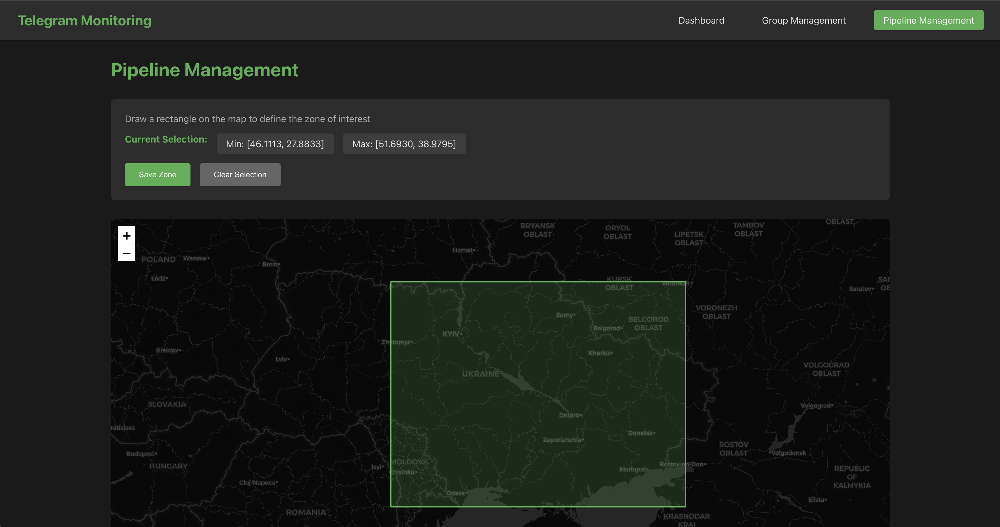
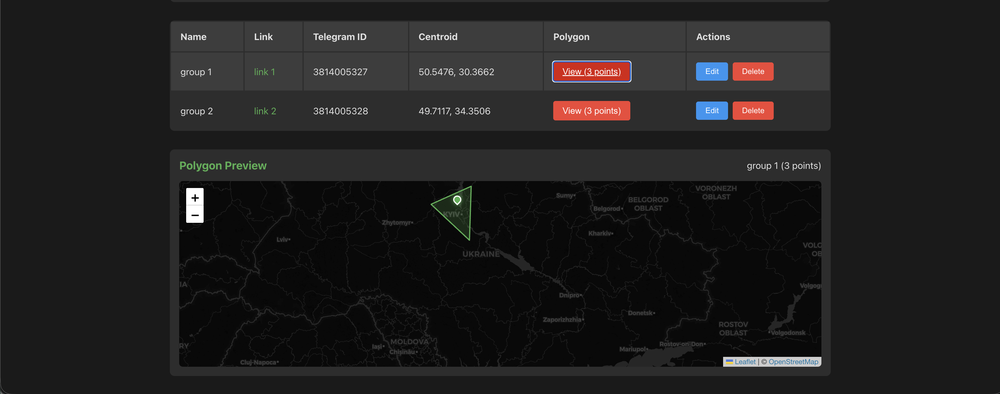
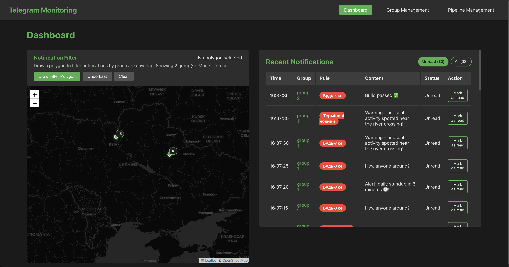
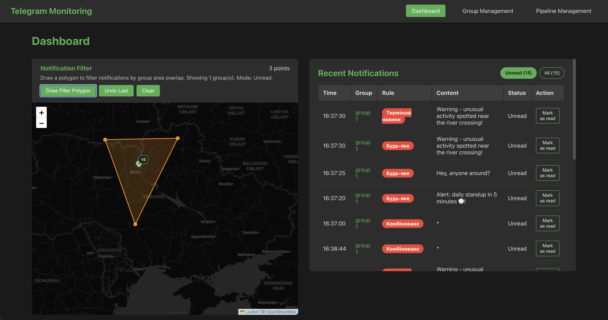

# QUICKSTART

Швидка перевірка працездатності проєкту.

## 1. Запуск проєкту з мок-сервером

```shell
APP_ENV=dev docker compose --profile infra --profile app --parallel 8 up --build
```

## 2. Базовий сценарій перевірки

1. Відкрийте [http://localhost:3000](http://localhost:3000).
2. Сконфігуруйте [зону інтересу](./README.md#22-конфігуруємо-зону-інтересу).

<details>
  <summary>Приклад</summary>

  
</details>

3. Створіть [групи](./README.md#21-додаємо-групи).  
   Для перевірки використайте Telegram ID: `3814005327`, `3814005328`.

<details>
  <summary>Приклад</summary>

  
</details>

4. Скиньте кеш мок-сервера.

```shell
curl -X POST localhost:8083/cache/reset
```

5. Відкрийте [дашборд](./README.md#24-спостерігаємо-за-дашбордом).

<details>
  <summary>Приклад</summary>

  
</details>

6. (Опціонально) Відфільтруйте групи для нотифікацій.

<details>
  <summary>Приклад</summary>

  
</details>
